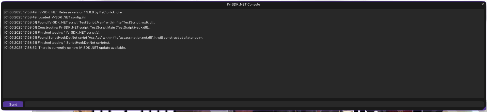

# The IV-SDK .NET Console

The **ConsoleUI** is an in-game console for IV-SDK .NET that allows you to execute commands and interact with your scripts in real-time.

---

### ❓ How to Open the ConsoleUI

- Press <kbd>F4</kbd> (default binding) to open the ConsoleUI.

---        

### ⚡ Available Commands
           
| Command                | Description                                                                               | Example                          |
|------------------------|-------------------------------------------------------------------------------------------|----------------------------------|
| `help`                 | Lists all commands with brief descriptions, or shows in-depth info for a specific one.    | `help` or `help loadscript`      |
| `clear`                | Clears the console.                                                                       | `clear`                          |
| `forceflush`           | Forces the console output to be written to the log file.                                  | `forceflush`                     |
| `checkforupdates`      | Checks if there is an update available for IV-SDK .NET.                                   | `checkforupdates`                |
| `autosave`             | Performs an instant autosave.                                                             | `autosave`                       |
| `save`                 | Opens the save menu.                                                                      | `save`                           |
| `saveplayerpos`        | Saves the current position and heading of the player.                                     | `saveplayerpos`                  |
| `loadscript`           | Loads a single script.                                                                    | `loadscript MyScript.ivsdk.dll`  |
| `reloadscripts`        | Reloads all scripts.                                                                      | `reloadscripts`                  |
| `abortscript`          | Aborts a single script.                                                                   | `abortscript MyScript.ivsdk.dll` |
| `abortscripts`         | Aborts all currently running scripts.                                                     | `abortscripts`                   |
| `startapi`             | Starts the IV-SDK .NET Manager API.                                                       | `startapi`                       |
| `stopapi`              | Stops the IV-SDK .NET Manager API.                                                        | `stopapi`                        |
| `manager`, `mgr`       | Toggles the manager window of IV-SDK .NET.                                                | `manager`                        |
| `publicfields`, `pf`   | Toggles the public fields window of a script.                                             | `publicfields MyScript.ivsdk.dll`|
| `teleport`, `tp`       | Teleports the player to the given coordinates.                                            | `teleport X, Y, Z`               |
| `docs`                 | Opens the official IV-SDK .NET GitHub Documentation in your default webbrowser.           | `docs`                           |
| `quit`, `exit`, `close`| Closes the game.                                                                          | `quit`                           |

*Some commands may have aliases or additional parameters. Type `help <command>` for more info.*

---

### 📝 Tips

- Console supports auto-complete for commands and script names.
- Errors and output will be displayed directly in the console.
- The console log will always be saved into a log file once the game closes.

---

[Back to Home](Home.md)