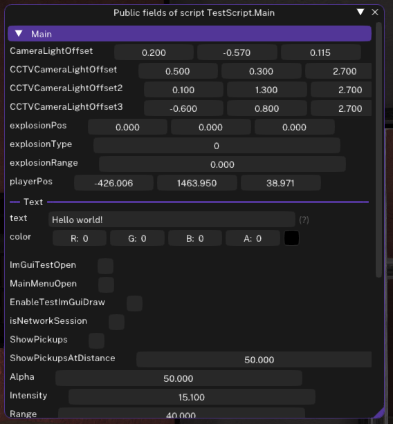

# Public Fields Window

The **Public Fields Window** is a powerful in-game tool that allows you to inspect and modify the public fields of your loaded scripts in real time.

---

### ❓ What does it do?

- **Lists all public fields** (variables) for any loaded script.
- **Interactively modify field values:** Change numbers, toggle booleans, or set strings on the fly.
- **Live debugging:** Instantly see the effect of changes in-game, perfect for tuning and troubleshooting your scripts!

---

### ❓ How can I access it?

- From **ConsoleUI**: Type in `publicfields` (or `pf`) and give it the name of the script you want to view the public fields of (e.g. `publicfields MyScript.ivsdk.dll`).
- From **ManagerUI**: Go to the `Scripts` tab, expand the header of the target script you want to view the public fields of, and check the `Show public field(s)` checkbox.

---

### 🧑🏽‍💻 How to use it as a developer?

Variables of your script will automatically be shown in the Public Fields window when they are marked as `public`.  
You can control the behaviour of variables, and also modify the layout in the Public Fields window to make more appealing using [Attributes](IVSDKDotNet-Classes/Attributes.md). Follow the link to learn more about them.

---

### ✅ Supported Types

All the managed types which the public fields window can show.

- `byte`, `sbyte`
- `short`, `ushort`
- `int`, `uint`
- `long`, `ulong`
- `float`, `double`, `decimal`
- `bool`
- `string`
- `Vector2`, `Vector3`, `Vector4`
- `Quaternion`
- `Color`
- `Size`, `SizeF`
- `Point`, `PointF`
- `ICollection`, `IList`

---

### 📝 Pro Tips

- Changes are applied instantly! No need to reload your script.
- Excellent for fine-tuning parameters like coordinates, ammunition, or toggling features while testing.

---

[Back to Home](../Home.md)