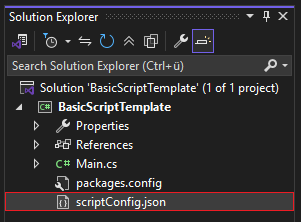
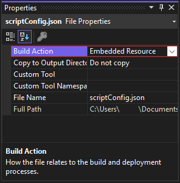

# Script Configuration File (scriptConfig.json)

Scripts can optionally include a `scriptConfig.json` file in their project.  
This file provides metadata and runtime hints for the IV-SDK .NET ManagerUI, IV Launcher, and related tooling.  
The file must be in valid JSON format. Below is a breakdown of all supported properties.

---

### ➕ Adding a `scriptConfig.json` file to your project

To add a blank file in project, right-click your project in the **Solution Explorer**, `Add` -> `New Item...` -> Search for a `Text File`, name it exactly `scriptConfig.json` and click on `Add`.

Now you should have a file named `scriptConfig.json` in your project like so:  


⚠️ **IMPORTANT**: After you've done that, we need to change the way the file gets treated when you build your project.  
Click on the `scriptConfig.json` file, and in the **Properties** window, change the `Build Action` to `Embedded Resource` like so:  


This will make sure the file actually gets **embedded into your project** so IV-SDK .NET can read it.

---

### ⚙️ `ForceNoAbort`

Type: `bool`  
Default: `false`

If set to `true`, the ManagerUI will prevent this script from being automatically aborted.  
Useful for scripts that require manual shutdown, making the script act more like an ASI mod.  
⚠️ This is against the point of IV-SDK .NET, only use it when you actually need it.

Example
```json
"ForceNoAbort": true
```

---

### ⚙️ `IVLauncherWorkshopID`

Type: `string` (GUID format)  
Default: `00000000-0000-0000-0000-000000000000`

Identifies the Workshop ID of the mod, enabling the IV Launcher to link to the mod page or check for updates.  
Learn more about the IV Launcher, and its features [here](https://gtaforums.com/topic/978788-gta-iv-launcher/).

Example
```json
"IVLauncherWorkshopID": "11111111-2222-3333-4444-555555555555"
```

---

### ⚙️ `Dependencies`

Type: `array of objects`  
Default: `null`

Specifies other required libraries. If any are missing, the IV Launcher can offer to download them (if Workshop IDs are provided).

Example
```json
"Dependencies": [
  {
    "FileName": "ClonksCodingLib.GTAIV.dll",
    "SpecificVersion": "<= 1.9",
    "DownloadURL": "https://example.com/ClonksCodingLib.GTAIV.dll",
    "IVLauncherWorkshopID": "11111111-2222-3333-4444-555555555555"
  }
]
```

🔍 Dependency Object Fields
| Field                            | Type       | Description                                                                                   |
|----------------------------------|------------|-----------------------------------------------------------------------------------------------|
| `FileName`                       | string     | The exact name of the required DLL or file.                                                   |
| `SpecificVersion`                | string     | Optional. Supports version constraints (e.g., `>= 1.2`, `<= 2.0`).                            |
| `DownloadURL`                    | string     | Optional. URL to fetch the dependency if missing.                                             |
| `IVLauncherWorkshopID`           | string     | Optional. Workshop ID to help the IV Launcher identify and manage dependencies.               |

---

### ⚙️ `IncompatibleMods`

Type: `array of strings`  
Default: `null`

Lists known incompatible mods. When a match is detected, the ManagerUI will show a warning and halt the script's loading until the user chooses to continue or cancel.

Example
```json
"IncompatibleMods": [
  "ZolikaPatch.asi",
  "ALM.net.dll",
  "ProjectThunder.ivsdk.dll"
]
```

---

### ✅ Example

```json
{
  "ForceNoAbort": true,
  "IVLauncherWorkshopID": "11111111-2222-3333-4444-555555555555",
  "Dependencies": [
    {
      "FileName": "ClonksCodingLib.GTAIV.dll",
      "SpecificVersion": "<= 1.9",
      "DownloadURL": "",
      "IVLauncherWorkshopID": "11111111-2222-3333-4444-555555555555"
    }
  ],
  "IncompatibleMods": [
    "ZolikaPatch.asi",
    "ALM.net.dll",
    "ProjectThunder.ivsdk.dll"
  ]
}

```

---

### 📘 Notes

- This file is optional - scripts will still run without it.
- Commenting is supported using `//` style (no inline comments) thanks to preprocessor handling.

---