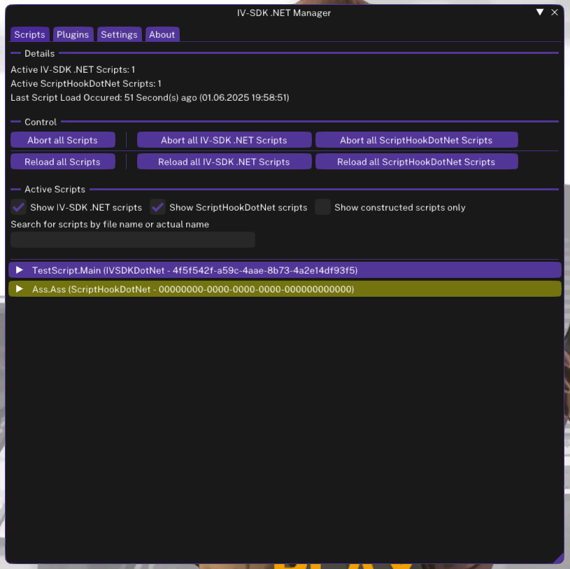

# The IV-SDK .NET Manager

The **ManagerUI** is a graphical in-game interface for managing your scripts and settings in IV-SDK .NET.

---

### ❓ How to Open the ManagerUI

- Press <kbd>Control+F10</kbd> (default binding) to open the ManagerUI.

---

### ✨ Features
The **ManagerUI** is organized into four main tabs, each offering powerful tools for managing your IV-SDK .NET experience:

- **Scripts**  
  - View all currently running scripts with live status indicators.
  - Reload or abort scripts individually or by type (e.g., `IV-SDK.NET`, `ScriptHookDotNet`).
  - Inspect script details, including public fields via the [Public Fields window](Developer/Public-Fields-Window.md).

- **Plugins**  
  - View all loaded ManagerUI-compatible plugins.
  - Reload or abort plugins on the fly.
  - Interact directly with plugins through their custom interfaces.

- **Settings**  
  - Modify IV-SDK .NET configuration options in real time.
  - Change hotkeys, UI preferences, and other runtime behaviors without editing config files.
  - Apply changes instantly - no restart required for most settings.

- **About**  
  - View version information, credits, and current supporters of IV-SDK .NET.

---

### 📝 Tips

- Most changes will apply instantly, but for some it is recommended to restart the game.
- For advanced options, refer to the documentation or tooltips within the ManagerUI.

---

[Back to Home](Home.md)